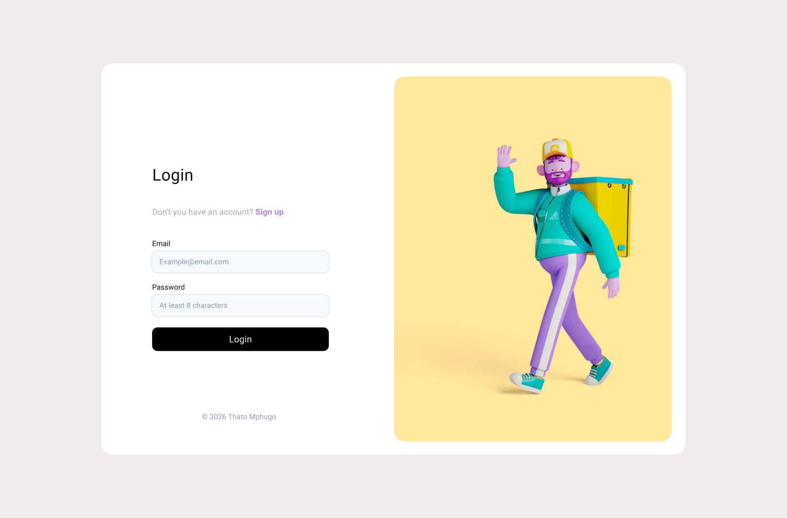
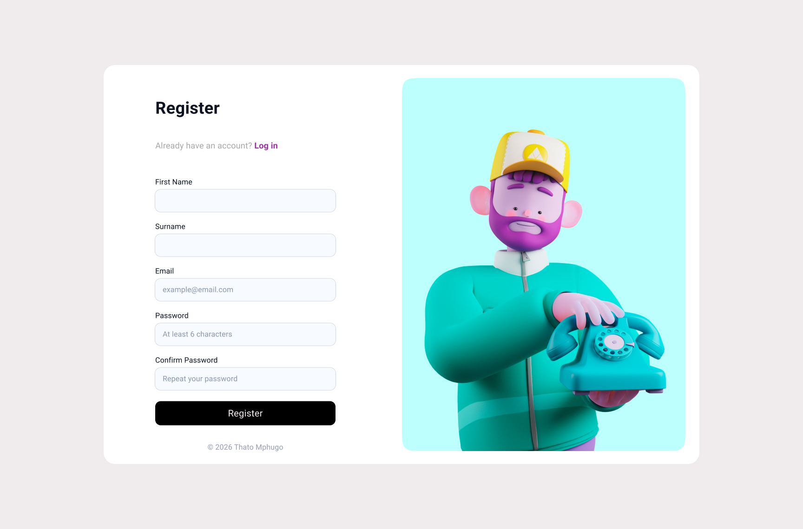
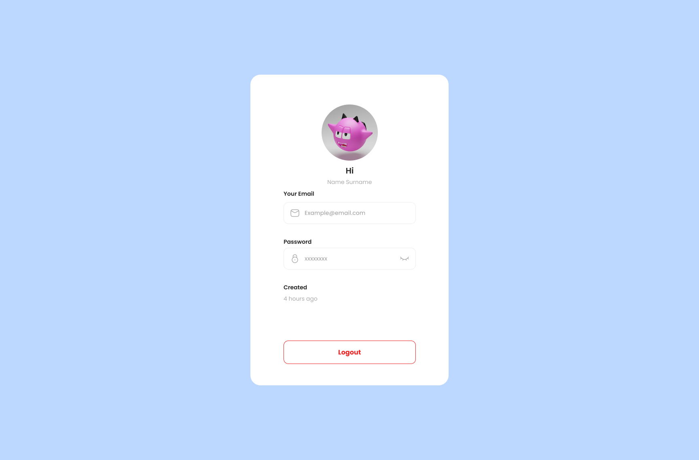

# 🔐 AuthAssesment

A full-stack authentication application built with React, C#, PostgreSQL, and Docker.

> **Live Demo:** [https://your-app.onrender.com](https://your-app.onrender.com) ← _replace with your Render URL_

---

## 📸 Screenshots

| Login | Register | Profile | 404 |
|-------|----------|---------|---------|
|  |  |  |  

---

## 🧱 Tech Stack

| Layer | Technology |
|-------|-----------|
| Frontend | React + TypeScript + Vite + Tailwind CSS |
| Backend | C# ASP.NET Core Web API |
| Database | PostgreSQL |
| Auth | JWT (JSON Web Tokens) |
| Validation | Zod (frontend) |
| Containerisation | Docker + Docker Compose |
| Testing | xUnit + Moq |

---

## 🏗️ Architecture

```
┌─────────────────────────────────────────────────┐
│                Docker Compose                    │
│                                                  │
│  ┌──────────────┐     ┌──────────────────────┐  │
│  │   React App  │────▶│   C# ASP.NET API     │  │
│  │   (nginx:80) │     │   (Port 5019)        │  │
│  └──────────────┘     └──────────┬───────────┘  │
│                                  │               │
│                       ┌──────────▼───────────┐  │
│                       │   PostgreSQL          │  │
│                       │   (Port 5432)         │  │
│                       └──────────────────────┘  │
└─────────────────────────────────────────────────┘
```

---

## 🚀 Getting Started

### Prerequisites

- [Docker Desktop](https://docs.docker.com/get-started/get-docker/)
- [Git](https://git-scm.com/)

### 1. Clone the repository

```bash
git clone https://github.com/ThatoMphugo/AuthAssesment.git
cd AuthAssesment
```

### 2. Create your `.env` file

Create a `.env` file in the root folder:

```env
POSTGRES_HOST=postgres
POSTGRES_PORT=5432
POSTGRES_DB=authdb
POSTGRES_USER=postgres
POSTGRES_PASSWORD=yourpassword
JWT_SECRET=*****************************
JWT_ISSUER=AuthAPI
JWT_AUDIENCE=AuthClient
JWT_EXPIRATIONDAYS=7
```

### 3. Run with Docker

```bash
docker-compose up --build
```

### 4. Open the app

| Service | URL |
|---------|-----|
| Frontend | http://localhost |
| API | http://localhost:5019 |

---

## 📡 API Endpoints

| Method | Endpoint | Auth Required | Description |
|--------|----------|---------------|-------------|
| POST | `/api/auth/register` | ❌ | Register a new user |
| POST | `/api/auth/login` | ❌ | Login and receive JWT |
| GET | `/api/user/profile` | ✅ Bearer Token | Get authenticated user details |

### Example Requests

**Register**
```json
POST /api/auth/register
{
  "firstName": "John",
  "lastName": "Doe",
  "email": "john@example.com",
  "password": "Password123"
}
```

**Login**
```json
POST /api/auth/login
{
  "email": "john@example.com",
  "password": "Password123"
}
```

**Get Profile**
```
GET /api/user/profile
Authorization: Bearer <your_jwt_token>
```

---

## 🧪 Running Tests

```bash
cd AuthAPI.Tests
dotnet test
```

### Test Coverage

| File | Tests |
|------|-------|
| `AuthServiceTests.cs` | Register + Login logic |
| `JwtServiceTests.cs` | Token generation + claims |
| `PasswordHasherTests.cs` | BCrypt hashing + verification |

---

## 📁 Project Structure

```
AuthAssesment/
├── AuthAPI/                  # C# ASP.NET Core Web API
│   ├── Controllers/          # Auth + User controllers
│   ├── Services/             # AuthService + JwtService + UserService
│   ├── Models/               # User model
│   ├── DTOs/                 # Request/Response DTOs
│   ├── Interface/            # Service interfaces
│   ├── Data/                 # AppDbContext (EF Core)
│   ├── Middleware/           # Exception handling middleware
│   └── Dockerfile
├── AuthAPI.Tests/            # Unit tests
│   └── Unit/
│       ├── AuthServiceTests.cs
│       ├── JwtServiceTests.cs
│       └── PasswordHasherTests.cs
├── AuthClient/               # React + TypeScript frontend
│   ├── src/
│   │   ├── api/              # Axios instance
│   │   ├── components/       # Reusable UI components
│   │   ├── context/          # AuthContext (JWT storage)
│   │   ├── pages/            # Auth + Profile pages
│   │   └── assets/           # Images
│   └── Dockerfile
├── docker-compose.yml
├── .env                      # Not committed - see setup above
└── README.md
```

---

## 🔒 Security

- Passwords are hashed using **BCrypt** before storage
- Authentication uses **JWT tokens** with configurable expiry
- Protected routes require a valid Bearer token
- Environment variables used for all secrets — never hardcoded

---

## 👤 Author

**Thato Mphugo**

--- 

## 📄 License

This project was built as part of a technical assessment.
